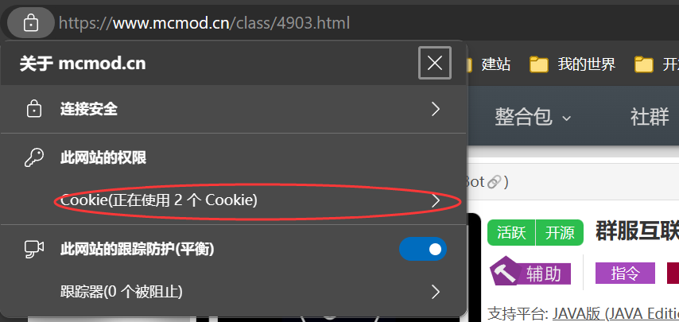
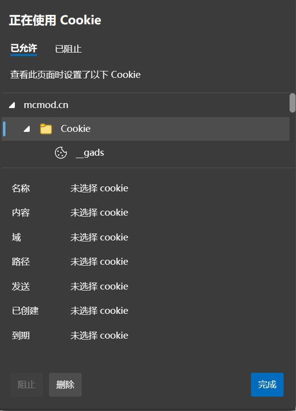
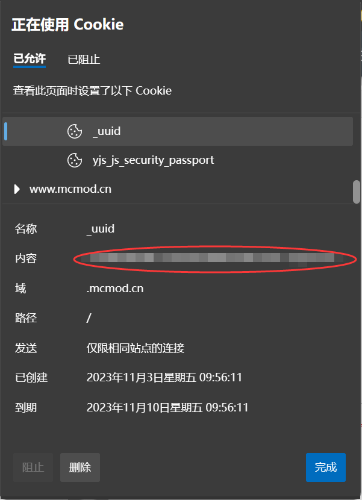

## mc百科部分 API

需要安装模块 `pip install requests ruamel.yaml`  
也可以参考 mcmod.py，即 API 在 Python 下的一种实现方式。  
需要在id.yml内建立相关模组信息，具体请参考 `文件上传`  

### 文件上传
- Cookie 有效期 30天，参照下面的登录流程获取。
- 可一次上传多个文件，按 file1、file2 的顺序。
- 文件名必须按照 `模组名-平台名(可省略)-mc版本-模组版本.jar` 命名
- 请将需要上传的模组放入mods文件夹内
- classID，即 mod 在百科的编号。
- platformList，支持平台，1 = JAVA版，2 = 基岩版。
- apiList，运作方式，1=Forge，2=Fabric，11=Quilt，13=Neo Forge，3=Rift，4=LiteLoader……
- tagList，文件标签，可选 snapshot，beta，client，server，dev，lite.

### 登录
注意 mc百科存在多设备登录限制，为避免顶掉浏览器端登录状态，可前往“个人中心 -> 设置 -> 安全设置”修改。  
需要的 Cookie 为 _uuid.  
首先请正常登录  
  
  
 
复制即可  
若短时间密码错误次数超过 3 次，会要求验证码，大概等待 30 分钟后可再次尝试。
